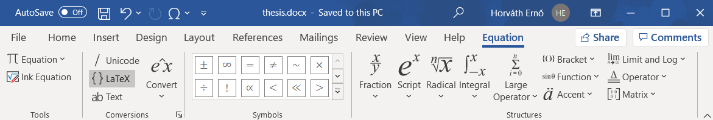
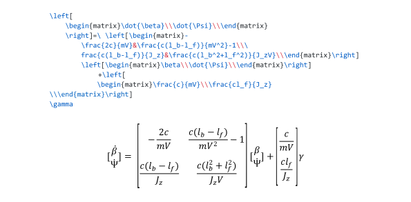
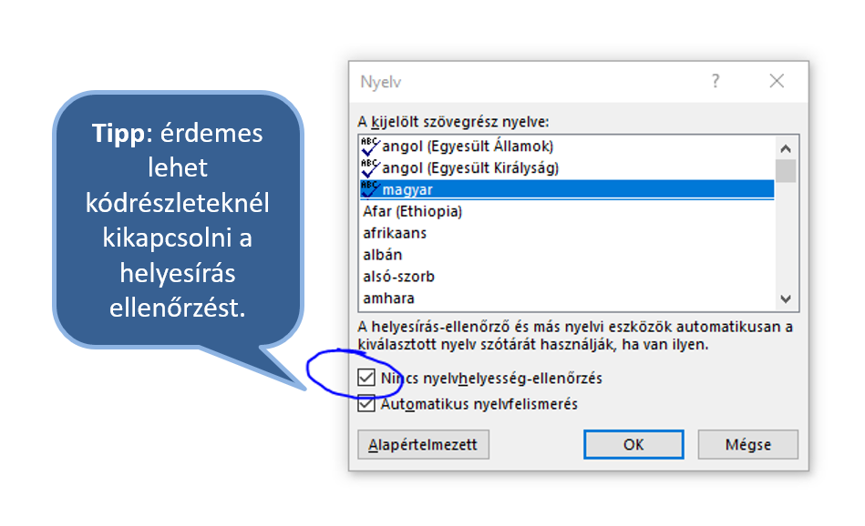

# English version
For english version please [click](readme-eng.md) here.

# Bevezetés
A jelen leírás csak ajánlásokat, "jó tanácsokat", ötleteket tartalmaz a szakdolgozat (BSc) vagy diplomamunka (MSc) elkészítéséhez.
Nem minden, a dokumentumban leírt ajánlás kötelező érvényű.

A szakdolgozat / diplomamunka célja: önálló, mérnöki munka, az egyetem alatt elsajátított tudáson alapszik, azt kiegészíti, alkalmazza, tervezési végrehajtási és tesztelési lépéseken keresztül.

# Határidők
A dokumentáció Szakdolgozatkészítés I. és II. valamint a Diplomamunka I. és II. tárgyakból legkésőbb vizsgaidőszak előtt 2 héttel érkezzen meg. Ugyanis jegyet csak a vizsgaidőszak első pár napjában lehet adni, de addigra át kell nézni és javítani kell 5-15 darab ~25 illetve ~60 oldalas munkát.

A szakdolgozat (1A) és diplomamunka (1C) engedélyező adatlapok leadási határideje általában a dolgozat megkezdése előtti félév vizsgaidőszaka előttre esik. 

Ezekről mindig pontos tájékoztatás található a tanszéki honlapon.

# A dolgozat készítése
Ahogy egy összetett szoftverrendszernél a szakdolgozat/diplomamunka készítésénél is jellemző a következő munkafolyamat:
Követelményelemzés, tervezés, megvalósítás (írás), refactor, tesztelés és a teljes munkafolyamat ismétlése, amíg kész nincs. 
## Nyelvezet
- Tényszerűség.
- Műszaki jellegű leírás.
- Az olvasónak feltételezhetünk egy mérnököt, aki általános ismeretekkel rendelkezik a dolgozatban tárgyalt témáról, de a speciális tématerületet nem ismeri.


# Konzulensek
- Belső konzulens: az egyetem formai követelményeinek betartása
- Külső konzulens: a technikai és terület specifikus kérdések tisztázása

A konzulenssel történő kapcsolatfelvétel és rendszeres kapcsolattartás a _hallgató feladata és felelőssége_! Ez általában emailben vagy személyesen történhet, továbbá a kódok megosztására célszerű valamilyen nyilvános repositoryt használni (pl GitHub, GitLab, Bitbucket, Assembla, stb.)

# Stilisztikai megkötések
## Helyesírás
Hasznos oldalak: 
- http://helyesiras.mta.hu/
- http://hu.wikipedia.org/wiki/Wikipédia:Helyesírás/Gyakori_elírások_listája

Figyeljünk az informatikában nem egységes rövidítésekre, betűszavakra:
 - JSON, C++, ZigBee, JavaScript, TCP/IP, GitHub, MySQL, MSSQL, Ruby on Rails, NumPy

## Képek
Ha a felbontás nem nyomdai minőségű (300 dpi), rajzoljuk újra, akár vektorosan.
Ha a dolgozatban magyar nyelven említünk egy fogalmat, a képen is úgy szerepeljen.
Képekre célszerű kereszthivatkozással hivatkozni. Így elkerülhető, hogy új kép beszúrása esetén átszámozódjanak a képeink.

### Logók
2019-benaz egytem új arcualtot vezetett be (https://eszk.sze.hu/szearculat). Értelemszerűen a diplomamunka / szakdolgozat is az új arculatnak megfelelő kinézet az elvárt.
Az új egyetemi logó:

Az új tanszéki logó:


## Képletek
Használjunk képletszerkesztőt.





## Forráskódok
Szintaxis kiemelés és monospaced betűtípus (ajánlott Consolas, kerülendő Courier New mert alig van benne különbség a kerek és a kapcsos zárójel karakterek között), például:


Kódrészleteket, sose képként, hanem szintaxis kiemeléssel másoljunk be. Itt érdemes lehet használni vagy a vs code-ot, vagy a notepad++ nppexport szintaxis kiemelőjét (esetleg valamilyen online módszert, mint a pastebin-t).

Például:
``` cpp
void CoordinateTransition::Init() {}

void CoordinateTransition::LatLonToUTMXY(const double lat, const double lon, double &utm_x, double &utm_y)
{
  MathLanLonToXY(DegToRad(lat), DegToRad(lon), UTMCentralMeridian(lon), utm_x,utm_y);
  utm_x = utm_x * kUTMScaleFactor + kUTMXCompensation;
  utm_y = utm_y * kUTMScaleFactor;
  if (utm_y < 0.0)
  {
    utm_y += kUTMYCompensation;
  }
}
```


## Hivatkozásjegyzék
https://support.office.com/hu-hu/article/irodalomjegyzék-idézetek-és-hivatkozások-létrehozáa-17686589-4824-4940-9c69-342c289fa2a5

https://support.office.com/en-us/article/add-citations-in-a-word-document-ab9322bb-a8d3-47f4-80c8-63c06779f127

- Generáljuk, IEEE formátum.
- A források túlnyomórészt könyvek / azonosítóval (ISBN, DOI, ISSN) ellátott források legyenek "sima" internetes források helyett.
- Ajánlott pl. itt forrásokat keresni: 
  - http://eisz.mtak.hu/ (Egyetemi IP-ről ingyenes források, Elektronikus Információszolgáltatás Nemzeti Program)
  - http://www.elsevier.com/
  - http://ieeexplore.ieee.org/
  - http://www.sciencedirect.com/
  - http://www.sciencemag.org/
- Megkülönböztetünk szó szerinti idézést és parafrázis, vagyis egy gondolat átfogalmazását. Az elsőt tegyük idézőjel közé, de mindkettőt hivatkozzuk.
- A legfontosabb kitétel a munka eredetisége és önállósága. Nem megengedett, sőt, súlyosan szankcionált bármely korábban készült szakdolgozat átvétele, másolása, a hivatkozás nélküli átvételeket tartalmazó szakdolgozat beadása! _Mindez a szakdolgozat elutasítását és a záróvizsgára bocsátás megtagadását vonja maga után!_
- A hivatkozások ajánlott száma legalább 20, legfeljebb 50 db. Továbbá erősen ajánlott a túlnyomórészt nyomtatott vagy valamilyen azonosítóval (ISBN, DOI, ISSN) ellátott források használata. Ezek ugyanis könnyebben visszakereshetők, védhetők, mint az internetes források. Az internetes forrásokkal a probléma, hogy kis túlzással naponta változhatnak és nincs garancia arra, hogy később is fellelhető lesz az adott változatuk.
- Hasznos lehet a régebbi szakdolgozatokat átnézni, pl. ötletet meríteni. Ezeket a következő címeken lehetséges elérni:
  - http://szakdolgozat.szerep.sze.hu
  - http://lib.sze.hu
- Egyetemi Könyvtárban, az olvasótermi számítógépeken hozzáférhetők a könyvtár által állományba vett elektronikus szakdolgozatok. Ezeken a számítógépeken kizárólag a SzeRep online dokumentumtárának megtekintésére, és katalógushasználatra van lehetőség. A gyűjteményből elérhetők a Széchenyi István Egyetem diplomaleadó rendszerébe 2015-től feltöltött szakdolgozatok, az elektronikus tananyagok, továbbá a doktori iskolákban készített PhD-disszertációk.
- A rendszerben tárolt szakdolgozatok kizárólag helyben használhatók.

# Első félév
- Szakdolgozatkészítés I. és Diplomatervezés I. `NGB_IN092_1` és `NGB_IN093_1`
- A választott témakör körülhatárolása, általános tájékozódás
- A program specifikálása (pl. UML diagramok készítése is)
- A szükséges technikák, technológiák elsajátítása (eddig ismeretlen SDK, API, programozási nyelv megismerése)
- Szakirodalmi anyagok gyűjtése, feltárása, a vonatkozó szakirodalom körének meghatározása
- A rendelkezésre álló anyagok rendszerezése, feldolgozása
- Kockázatok elemzése, tesztprogramok írása
- Nagyjából 25 oldalas dokumentum, aminek tartalma később felhasználható a szakdolgozatban/diplomamunkában

# Második félév
- Szakdolgozatkészítés II. és Diplomatervezés II. `NGB_IN092_2` és `NGB_IN093_2`
- Programírás és tesztelés
- A dolgozat végső megfogalmazása, elkészítése
- A leírtak pontosítása, formai megoldások véglegesítése
- Az dolgozat elektronikus formában történő rögzítése, nyomtatása, köttetése, leadása

# Linkek
- Informatika Tanszék honlapja: http://it.sze.hu/
- Informatika Tanszék / diplomatervezés: http://it.sze.hu/diplomatervezes
